# CobblemonHammers

A Cobblemon side-mod that introduces 10 unique craftable hammers forged from Pokémon evolution stones, each mining a 3x3 area with tier progression from Iron to Netherite equivalent.

---

## Showcase

### In Game
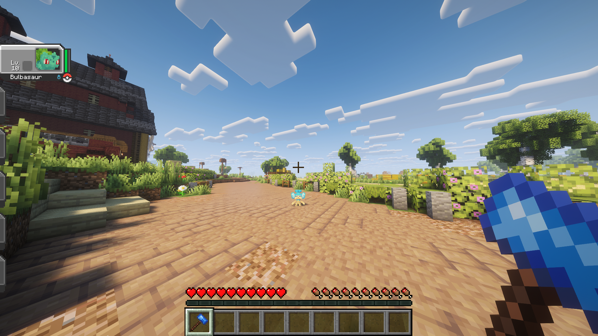
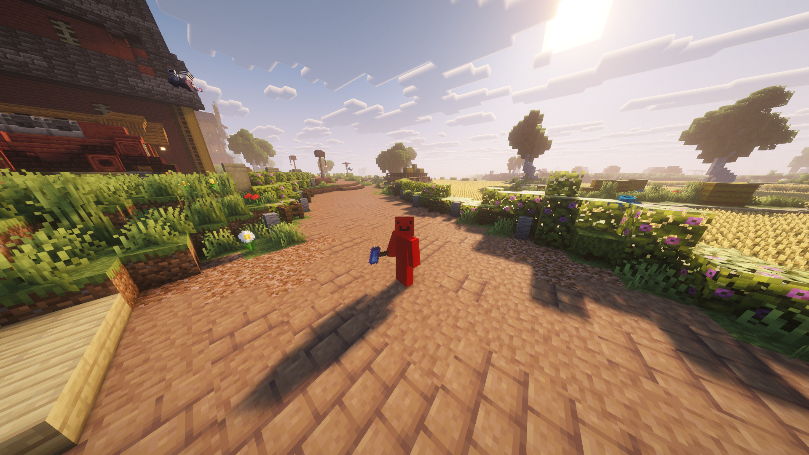

### Creative Tab
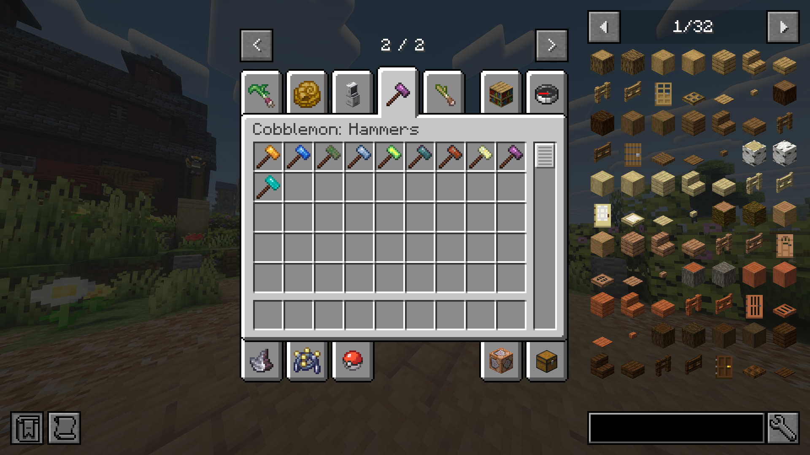

### JEI Integration
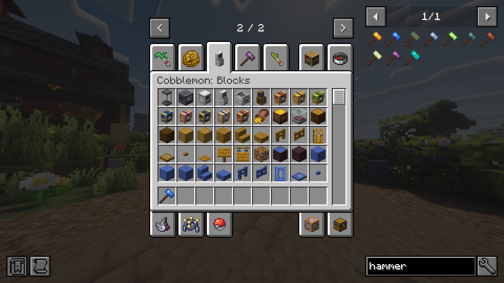

### Crafting Recipes
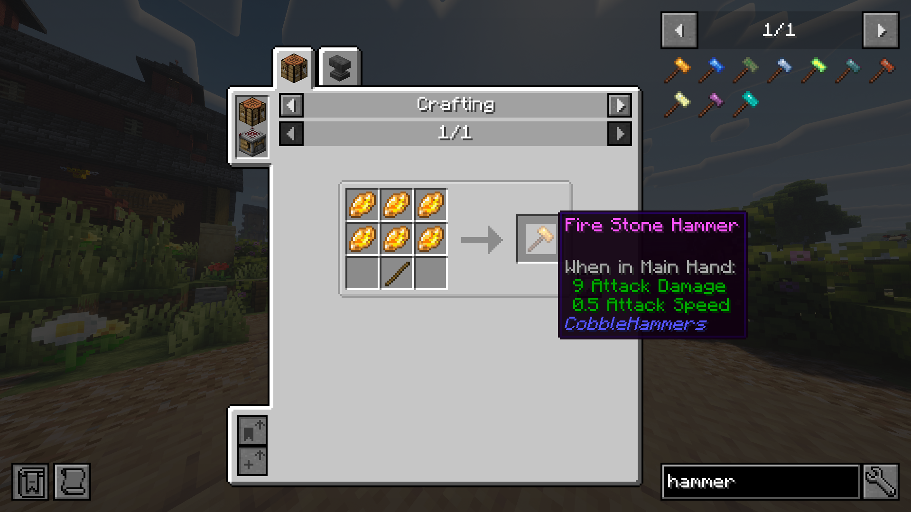
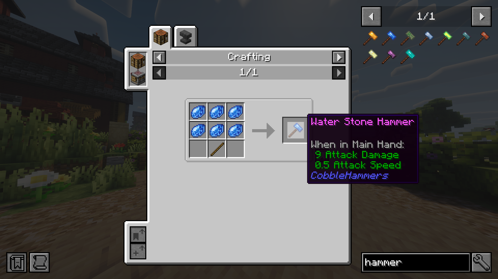
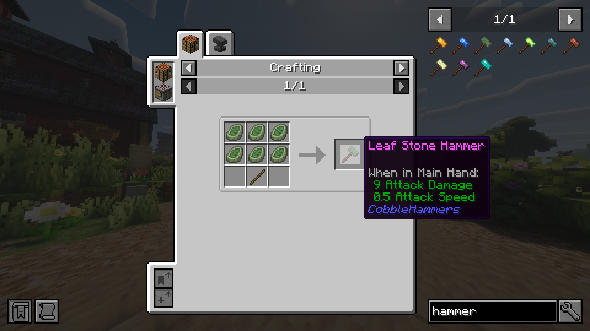
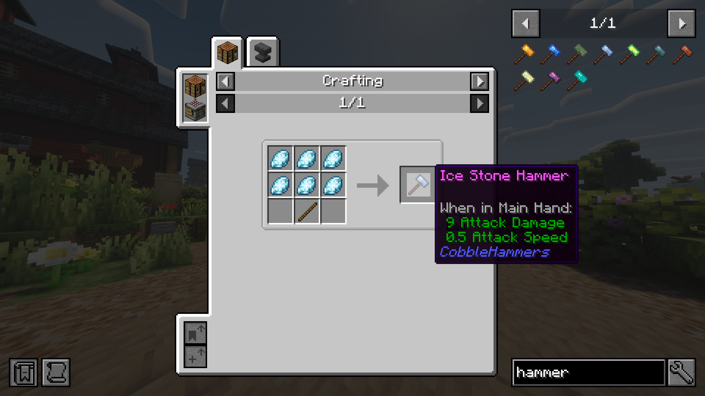
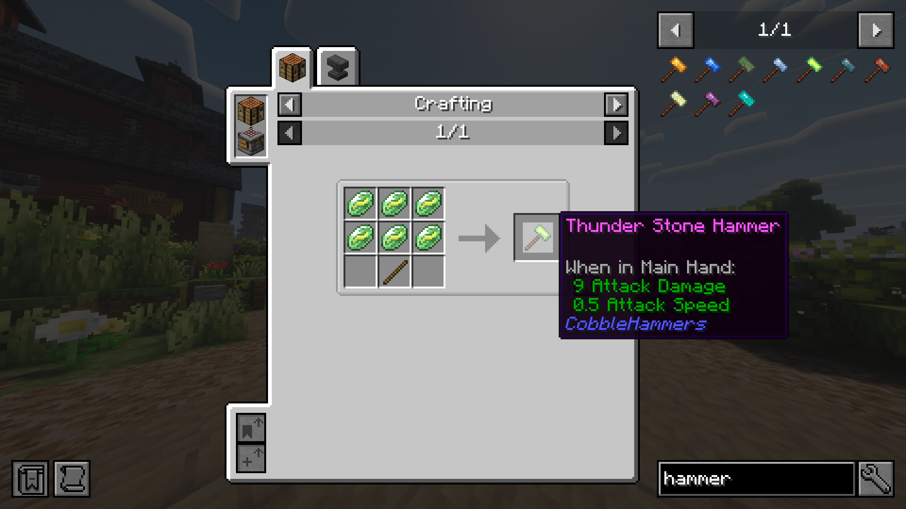
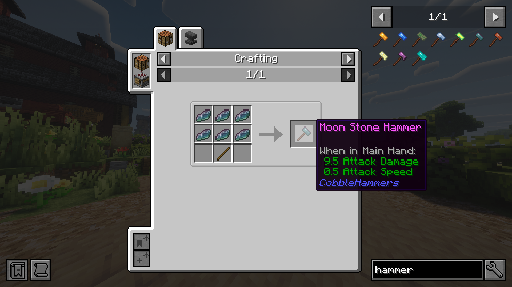
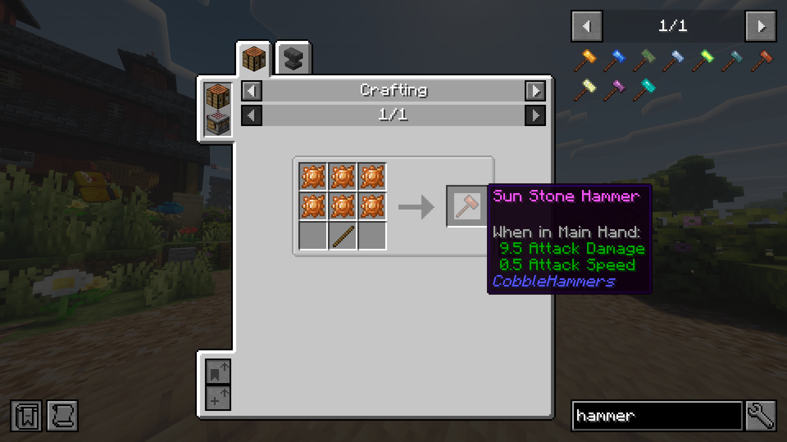
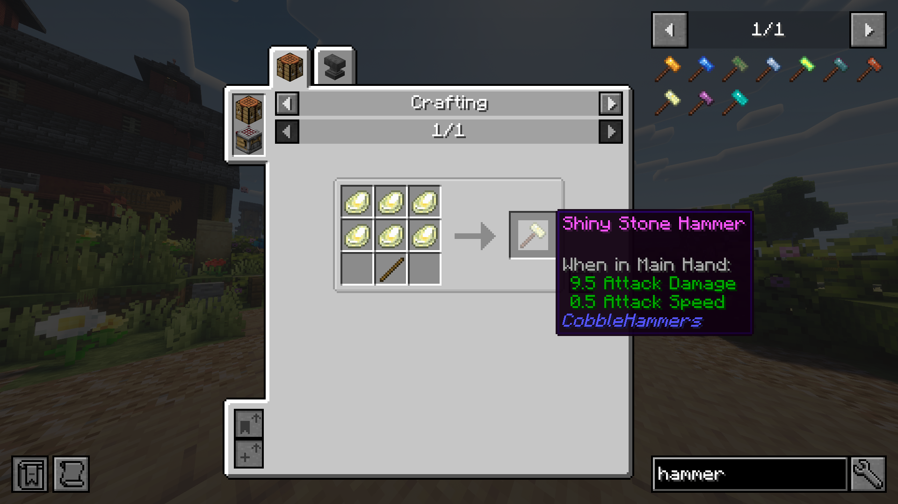
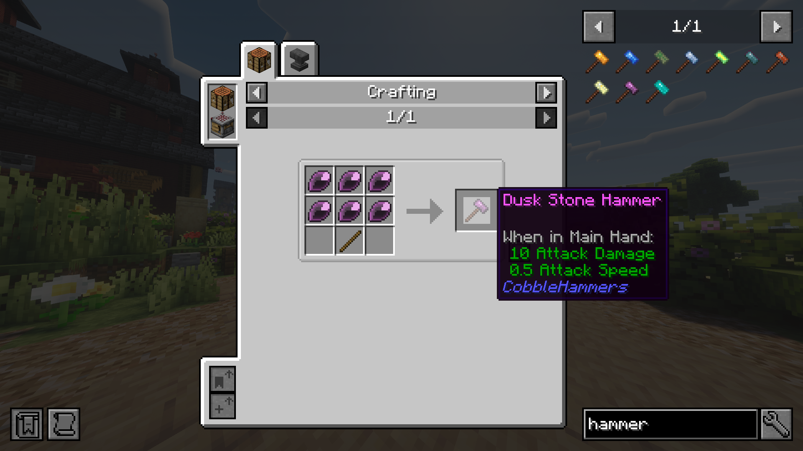
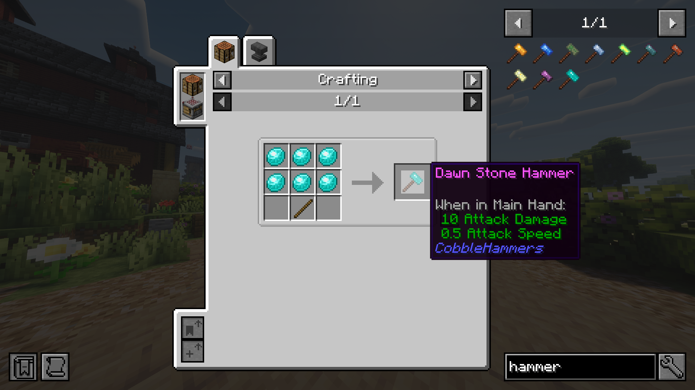

---

## Features
- 10 hammers crafted from Cobblemon evolution stones
- 3x3 area mining with correct tool tag enforcement
- Shift to single mine
- Three tier progression — Iron, Diamond and Netherite equivalent
- Full enchantment table support
- JEI recipe integration
- Cobblemon themed creative tab

---

## Hammers

| Hammer | Tier | Evolution Stone |
| :--- | :---: | :---: |
| Fire Stone Hammer | Iron | Fire Stone |
| Water Stone Hammer | Iron | Water Stone |
| Leaf Stone Hammer | Iron | Leaf Stone |
| Ice Stone Hammer | Iron | Ice Stone |
| Thunder Stone Hammer | Iron | Thunder Stone |
| Moon Stone Hammer | Diamond | Moon Stone |
| Sun Stone Hammer | Diamond | Sun Stone |
| Shiny Stone Hammer | Diamond | Shiny Stone |
| Dusk Stone Hammer | Netherite | Dusk Stone |
| Dawn Stone Hammer | Netherite | Dawn Stone |

---

## Dependencies
| Mod Name | Required Version | Purpose                  | Link |
| :--- |:----------------:|:-------------------------| :---: |
| **NeoForge** |   `21.1.182+`    | Mod Loader               | [Download](https://neoforged.net) |
| **Cobblemon** |  `1.5.2+1.21.1`  | Core Pokémon API         | [Download](https://modrinth.com/mod/cobblemon) |
| **JEI** |     `19.0+`      | Recipe Viewer (Optional) | [Download](https://modrinth.com/mod/jei) |
| **Architectury API** |     `13.0+`      | Core Multiplatform API   | [Download](https://modrinth.com/mod/architectury-api) |
---

## Installation
1. Ensure you have **NeoForge 21.1.182+** installed
2. Drop `cobblemon-x.x.x.jar` into your `mods/` folder
3. Drop `cobblehammers-x.x.x.jar` into your `mods/` folder
4. Drop `architectury-x.x.x.jar` into your `mods/` folder 
5. Launch the game

---

## License
CobbleHammers is licensed under the [CobbleHammers License v1.0](LICENSE.md).
You are free to include this mod in modpacks with credit. Commercial use is prohibited.
